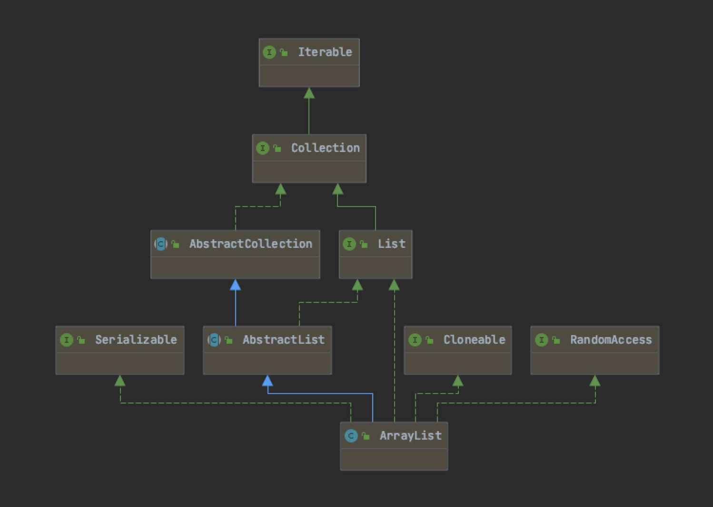

# ArrayList

## 类图

首先放上类图

## 常量

~~~ java

// 初始默认大小为10
private static final int DEFAULT_CAPACITY = 10;

// 空的数组（在构造方法为给定大小且=0的时候使用）
private static final Object[] EMPTY_ELEMENTDATA = {};

// 默认无参构造函数使用，代表一个空的数组
private static final Object[] DEFAULTCAPACITY_EMPTY_ELEMENTDATA = {};

// ArrayList的元素存放区，只要不是0，就是使用这个，默认的大小是DEFAULT_CAPACITY，即10
transient Object[] elementData;

private int size;

~~~

## 构造方法

~~~ java
// 无参构造函数，这里使用了DEFAULTCAPACITY_EMPTY_ELEMENTDATA，
// 刚创建的时候长度是DEFAULTCAPACITY_EMPTY_ELEMENTDATA，即0。
// 如果往其中放置了任何元素，默认大小都会变为10
public ArrayList() {
    this.elementData = DEFAULTCAPACITY_EMPTY_ELEMENTDATA;
}

// 有参构造函数：声明了初始容量的构造函数
public ArrayList(int initialCapacity) {
    // 如果参数的容量大于0
    if (initialCapacity > 0) {
        // 则创建一个给定容量大小的Object数组，赋值给elementData
        this.elementData = new Object[initialCapacity];
    // 如果参数的容量大小=0
    } else if (initialCapacity == 0) {
        // 则将EMPTY_ELEMENTDATA赋值给elementData（就是给定一个空的数组）
        this.elementData = EMPTY_ELEMENTDATA;
    // 如果参数小于0
    } else {
        // 抛出异常，给定的参数不能为initialCapacity异常
        throw new IllegalArgumentException("Illegal Capacity: "+
                                            initialCapacity);
    }
}

// 有参构造函数：参数为一个给定的collection集合（）
public ArrayList(Collection<? extends E> c) {
    // 首先将给定的参数转换为数组，并复制给elementData（toArray是定义在Collection的方法，所有子类必须实现）
    elementData = c.toArray();
    // 获取elementData的长度赋值给size,并判断size是否等于0
    if ((size = elementData.length) != 0) {
        // c.toArray might (incorrectly) not return Object[] (see 6260652)
        // 如果不等于0，判断elementData这个类是否是Object类
        // 这里是可能不是Objcet数组，因为实现Collection接口之后，需要重写toArray(),重写的时候，可能返回的不是Object类型的
        if (elementData.getClass() != Object[].class)
        // 如果不是Objct,那么久将其转换为Object类型的再进行赋值给elementData
            elementData = Arrays.copyOf(elementData, size, Object[].class);
    } else {
        // replace with empty array.
        // 如果是空，则将EMPTY_ELEMENTDATA赋值给elementData（就是给定一个空的数组）
        this.elementData = EMPTY_ELEMENTDATA;
    }
}
~~~

## Add方法

- 校验容量是否足够新增元素
  - 如果不够新增元素，则开始扩容，扩容的长度为现有容量的1.5倍
  - 扩容时，是新创建一个Object[],然后将原来的元素copy进去，然后重新指向给elementData
- 新增，在现有数据大小的+1位置新增
- 返回true

~~~ java
public boolean add(E e) {
    // 首先校验容量，并确定是否需要进行扩容，如果需要扩容，则在这个方法内部完成了扩容
    ensureCapacityInternal(size + 1);  // Increments modCount!!
    // 在现有长度+1的索引位置上赋值
    elementData[size++] = e;
    return true;
}

// 检验内部容量的方法,minCapacity代表能存放元素的最小容量
private void ensureCapacityInternal(int minCapacity) {
    // calculateCapacity(elementData, minCapacity)决定是返回初始容量还是最小容量
    // 如果当前elementData为空，就返回初始容量和最小容量中的最大值
    // 如果不为空，则返回最小容量
    ensureExplicitCapacity(calculateCapacity(elementData, minCapacity));
}

// 计算容量
private static int calculateCapacity(Object[] elementData, int minCapacity) {
    // 如果elementData是空的数组
    if (elementData == DEFAULTCAPACITY_EMPTY_ELEMENTDATA) {
        // 那么就返回初始容量10和能存放元素的最小容量中的较大值
        return Math.max(DEFAULT_CAPACITY, minCapacity);
    }
    // 如果不是空，则返回能存放元素的最小的容量
    return minCapacity;
}

private void ensureExplicitCapacity(int minCapacity) {
    // 修改计数+1，可以保证防止并发修改
    modCount++;

    // overflow-conscious code
    // 如果最小保证容量大于现有的长度，就说明需要进行扩容（即现有的大小不够新增下一个元素了，就需要扩容）
    if (minCapacity - elementData.length > 0)
        grow(minCapacity);
}

// 扩容方法
private void grow(int minCapacity) {
    // overflow-conscious code
    // 获取原始的容量大小为oldCapacity
    int oldCapacity = elementData.length;
    // 新容量为：原始容量+ 原始容量/2，(即原始容量的1.5倍)
    int newCapacity = oldCapacity + (oldCapacity >> 1);
    // 如果新的容量仍然小于原始容量，则新的容量就是原始容量（取大的值）
    // 比如需要20个，原数组是10，扩容后也只有15个，这个时候就不够了。在这是就直接使用20
    if (newCapacity - minCapacity < 0)
        newCapacity = minCapacity;
    // 如果新的容量大于2^{31}-1-8，则根据初始容量重新生成一个容量
    if (newCapacity - MAX_ARRAY_SIZE > 0)
        newCapacity = hugeCapacity(minCapacity);
    // minCapacity is usually close to size, so this is a win:
    // 使用Arrays.copyOf创建一个新的数组，并赋值给elementData
    elementData = Arrays.copyOf(elementData, newCapacity);
}

private static int hugeCapacity(int minCapacity) {
    // 如果初始容量小于0，则抛出异常
    if (minCapacity < 0) // overflow
        throw new OutOfMemoryError();
    // 柔则判断初始容量是否大于2^{31}-1-8，如果是则返回2^{31}-1，否则就返回2^{31}-1-8
    return (minCapacity > MAX_ARRAY_SIZE) ?
        Integer.MAX_VALUE :
        MAX_ARRAY_SIZE;
}

~~~
