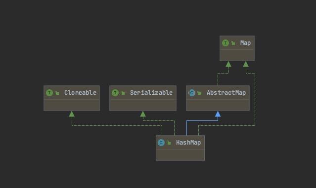

# HashMap

面试中可能有的坑：
红黑树的进化条件：当Node链表的长度大于树化阈值8且Map中总元素的数量大于树的最小容量64的时候，才会进行红黑树的树化操作

## 类图

首先上类图

## 常量

~~~ java

// 通过table数组，对数据进行存放。
// 根据key计算出在数组中的位置。,然后将key和value形成一个Node节点，进行存放
// key的索引计算方式是：tab[(table.length - 1) & hash]确定。即将数组的大小减一和key的hash值相与操作
transient Node<K,V>[] table;

// table数组初始容量大小（16）
static final int DEFAULT_INITIAL_CAPACITY = 1 << 4; 

// table数组最大容量 1073741824
static final int MAXIMUM_CAPACITY = 1 << 30;

// table数组扩容操作默认负载因子 0.75
static final float DEFAULT_LOAD_FACTOR = 0.75f;

// Node链表的树化阈值 8 
static final int TREEIFY_THRESHOLD = 8;

// Node链表的树退化阈值
static final int UNTREEIFY_THRESHOLD = 6;

// Node链表的进化为树的最小容量
// 红黑树的进化条件：当Node链表的长度大于树化阈值8且Map中总元素的数量大于64的时候，才会进行红黑树的树化操作
static final int MIN_TREEIFY_CAPACITY = 64;

~~~

## Node内部类

HashMap通过维护着这个Node完成了当key在tab数组中的索引位置相等时，数据的存放问题  
> 两个key在table数组中的存放位置是有可能相同的，当相同的时候，就是通过了Node形成链表。
> 相同的原因是：tab[(table.lenth - 1) & hash]操作。&操作符：同为1则为1，否则为0。所有位置很有可能重复

### Node的属性

~~~ java

// Node的hash值
final int hash;
// key的对象
final K key;
// value的对象
V value;
// next节点
Node<K,V> next;

~~~

## PUT方法

在Put的时候，首先根据key获取到该key在tab数组中对应的位置（tab[(table.lenth - 1) & hash]。  
然后判断数组中的该位置是否存在Node元素：  
    如果不存在，就讲vlue和key形成Node节点放置在该位置  
    如果已经存在Node元素，这个是否就形成链表。如果链表中的数据比较多（>树化阈值8），则会进行树化形成红黑树  

可以参考链接：
<https://blog.csdn.net/lukabruce/article/details/98033819>

~~~ java

public V put(K key, V value) {
    return putVal(hash(key), key, value, false, true);
}

final V putVal(int hash, K key, V value, boolean onlyIfAbsent, boolean evict) {
    // 定义一个table数组用来存放原先的Map中的所有元素，定义一个p的数据节点，一个int n ,一个int i 
    Node<K,V>[] tab; Node<K,V> p; int n, i;
    // 如果现有的table数组为null，或者tab数组的大小是0，这个时候就执行resize方法
    // resize()执行的结果是，会创建数组指向tab，数组大小cap为16，thr阈值为12
    if ((tab = table) == null || (n = tab.length) == 0)
        // resize()方法是根据已有的元素来重新获tab数组取大小
        n = (tab = resize()).length;
    // 通过(n - 1) & hash，判断得到了该key应该在数组中存放的位置
    // 判断数据的该节点是否为存在元素
    if ((p = tab[i = (n - 1) & hash]) == null)
        // 如果不存在元素，则创建一个Node放置在该位置
        tab[i] = newNode(hash, key, value, null);
    // else代表了该节点已经存在元素。这个时候就会形成链表或者是红黑树
    else {
        
        Node<K,V> e; K k;
        if (p.hash == hash &&
            ((k = p.key) == key || (key != null && key.equals(k))))
            e = p;
        else if (p instanceof TreeNode)
            e = ((TreeNode<K,V>)p).putTreeVal(this, tab, hash, key, value);
        else {
            for (int binCount = 0; ; ++binCount) {
                if ((e = p.next) == null) {
                    p.next = newNode(hash, key, value, null);
                    // 如果长度大于了树化阈值，这里就进行树化操作（树化阈值为8）
                    // TODO 形成共黑叔，这里可能有些复杂，等以后有时间了详细去看看
                    if (binCount >= TREEIFY_THRESHOLD - 1) // -1 for 1st
                        treeifyBin(tab, hash);
                    break;
                }
                if (e.hash == hash &&
                    ((k = e.key) == key || (key != null && key.equals(k))))
                    break;
                p = e;
            }
        }
        if (e != null) { // existing mapping for key
            V oldValue = e.value;
            if (!onlyIfAbsent || oldValue == null)
                e.value = value;
            afterNodeAccess(e);
            return oldValue;
        }
    }
    ++modCount;
    if (++size > threshold)
        resize();
    afterNodeInsertion(evict);
    return null;
}

/**
重新定义Node数组
**/
final Node<K,V>[] resize() {
    // 定义oldTab位旧的数组
    Node<K,V>[] oldTab = table;
    // 判断旧的数组是否是为null，如果为null，则定义旧的容量为0，否则定义旧的容量为旧的数组的大小
    int oldCap = (oldTab == null) ? 0 : oldTab.length;
    // 从属性中获取阈值。如果旧的数组为null，则threshold就为0。如果不为null,则一般就是旧的大小*负载因子（负载因子0.75）
    int oldThr = threshold;
    // 定义新的数组的大小和阈值为0
    int newCap, newThr = 0;
    // 如果旧的容量大于0
    if (oldCap > 0) {
        // 则判断旧的大小是否超过了最大值（2 ^ 32 次幂）
        if (oldCap >= MAXIMUM_CAPACITY) {
            // 如果为TRUE，就给阈值设定为Integer的最大值
            threshold = Integer.MAX_VALUE;
            // 这个时候就不进行扩容，就直接返回原来的数组（扩无可扩了）
            return oldTab;
        }
        // 如果不是，那么就设定新的大小为旧的大小的两倍。
        // 校验是否超过了最大容量并且校验就旧的大小是否超过了初始容量16
        else if ((newCap = oldCap << 1) < MAXIMUM_CAPACITY &&
                    oldCap >= DEFAULT_INITIAL_CAPACITY)
            // 如果新的容量小于最大容量 且 旧的容量大于初始值。则设定新的阈值为旧的阈值的两倍
            // 这里的两倍就是相当于 新的容量 * 负载因子。因为左移的效率更高
            newThr = oldThr << 1; // double threshold
    }
    // 如果旧的容量不大于0且旧的阈值大于0
    else if (oldThr > 0) // initial capacity was placed in threshold
        // 那么就设定新的大小就是旧的阈值
        newCap = oldThr;
    // 如果旧的容量不大于0且旧的阈值不大于0
    else {               // zero initial threshold signifies using defaults
        // 那么就设置新的大小为初始值
        newCap = DEFAULT_INITIAL_CAPACITY;
        // 设置新的阈值为默认负载因子 * 默认初始容量（这种情况一般出现在新new HashMap然后初次put的时候）
        newThr = (int)(DEFAULT_LOAD_FACTOR * DEFAULT_INITIAL_CAPACITY);
    }
    // 如果新的容量等于0
    if (newThr == 0) {
        // ft = 新的容量 * 负载因子
        float ft = (float)newCap * loadFactor;
        // 校验新的容量是否小于最大容量 且 ft是否小于最大容量
        // 如果是，则新的阈值是ft（即新的容量 * 负载因子），如果不是，则是Integer的最大值
        newThr = (newCap < MAXIMUM_CAPACITY && ft < (float)MAXIMUM_CAPACITY ?
                    (int)ft : Integer.MAX_VALUE);
    }
    // 将新的阈值进行指向阈值
    threshold = newThr;
    @SuppressWarnings({"rawtypes","unchecked"})
        // 定义一个新的数组，（新的数组其实就是扩容的数组后的数组）
        Node<K,V>[] newTab = (Node<K,V>[])new Node[newCap];
    // 将新定义的数组指向table
    table = newTab;
    // 如果就得数组不为null，那还需要将原数组copy过来。如果是null，那么就直接将新数组就返回了
    if (oldTab != null) {
        // 遍历
        for (int j = 0; j < oldCap; ++j) {
            // 声明一个节点e
            Node<K,V> e;
            // 获取旧数组的对应节点位置，判断是否为null
            if ((e = oldTab[j]) != null) {
                // 如果不为null，则将旧的数组的这个节点置为null（置为null的目的是方便GC？）
                oldTab[j] = null;
                // 校验下一个节点是不是null
                if (e.next == null)
                    // e.hash是算出hash值。然后与(newCap -1)进行与操作。然后确定这个Node的新位置
                    // 进行与操作的原因是： 算出的hash值可能超过索引的最大值。在进行与操作之后，就不会超过最大索引了
                    // 例如：容量为16的情况下,e.hash为17，直接放置就会索引越界异常。单将17&(16-1)=10001&1111=1
                    // &是与操作符，一假为假，全真才是真：1&0=0,1&1=1,0&0=0,0&1=0;有一个0就是假，全是1才是1
                    newTab[e.hash & (newCap - 1)] = e;
                // 如果当前节点是树形节点
                else if (e instanceof TreeNode)
                    // 那么就树进行分割操作
                    ((TreeNode<K,V>)e).split(this, newTab, j, oldCap);
                // 既不是树又不是null,则代表next有值得情况下
                else { // preserve order
                    // 定义低位的头和低位的尾
                    Node<K,V> loHead = null, loTail = null;
                    // 定义高位的头和高位的尾
                    Node<K,V> hiHead = null, hiTail = null;
                    Node<K,V> next;
                    // 重要！！！
                    // 将同一桶中的元素根据(e.hash & oldCap)是否为0进行分割，分成两个不同的链表，完成rehash
                    // (最开始的时候是与old-1进行与操作，决定了原来的位置，现在与old进行与操作。所以根据结构来算，要不就是原先的数不动，要不就是变成了原先的二倍)
                    // 举个例子：
                    // 00101 和 10101 与 (old-1)即 1111 = 101
                    // 但是：当 00101 和 10101 与 old （即10000） 进行与操作时：
                    // 00101 & 10000 = 00000 = 0
                    // 10101 & 10000 = 10000 != 0
                    // 通过这个操作，就完成了分割（就是下面1.2.两个操作）
                    do {
                        // 获取e的next节点
                        next = e.next;
                        // 当e.hash与oldCap进行与操作
                        // (1.)与操作的结果=0就是索引不变的链表（lo）
                        if ((e.hash & oldCap) == 0) {
                            // 如果低位链表的尾是null(即代表现在的这个链表是不是空的)
                            if (loTail == null){
                                 // 如果为空的，就把这个节点添加在头的位置
                                loHead = e;
                            }   
                            // 如果不是空的
                            else{
                                // 那么就讲这个节点添加在尾部节点的下一个位置
                                loTail.next = e;
                            }

                            // 然后就将loTail节点后移一个位置，指向了原先节点的loTail.next
                            // 可以理解为：loTail = loTail.next
                            loTail = e;
                        }
                        // （2.）与操作的结果!=0就是索引变化的链表(hi)
                        else {
                            // 如果高位的头是null
                            if (hiTail == null)
                                // 设定e是高位的头
                                hiHead = e;
                            // 否则
                            else
                                // 设定高位尾的下一个节点是e
                                hiTail.next = e;
                            hiTail = e;
                        }
                        // 遍历直到最后一个节点为止
                    } while ((e = next) != null);
                    // 如果低位的链表不是null
                    if (loTail != null) {
                        // 那么久设定低位链表的next值为null
                        loTail.next = null;
                        // 将低位的链表保存在原先位置上
                        newTab[j] = loHead;
                    }
                    // 同理，对高位链表也做相同的判断
                    if (hiTail != null) {
                        hiTail.next = null;
                        // 将高位链表的位置变为当前位置+旧容量的位置
                        newTab[j + oldCap] = hiHead;
                    }
                }
            }
        }
    }
    // 将新的数组进行返回
    return newTab;
}
~~~

## GET方法

参数为key，首先根据key计算出Hash值，然后找到这个key所对应的Node节点，然后再得到这个节点所对应的值

~~~ java
// 参数为key，返回值为value对应的泛型，如果没有对应的key，则返回null
public V get(Object key) {
    // 声明一个Node节点，用来接收getNode的值
    Node<K,V> e;
    // Node节点是否为null，如果为null，则返回null,如果不为null，则将Node所对应的value进行返回
    return (e = getNode(hash(key), key)) == null ? null : e.value;
}

final Node<K,V> getNode(int hash, Object key) {
    // 声明tab数组，声明first节点和e节点，定义n和key的泛型对象
    Node<K,V>[] tab; Node<K,V> first, e; int n; K k;
    // 将Map自带的table数组指向tab，数组的大小指向n.将对应位置的第一个Node指向first
    // tab[(n - 1) & hash]即找到hash值在table数组中所对应的位置（这里可以看看put方法，在放置的时候就是按照这个方式来进行放置的）
    if ((tab = table) != null && (n = tab.length) > 0 &&
        (first = tab[(n - 1) & hash]) != null) {
        // 找到数组对应的位置的Node元素，校验hash值是否相等。并校验key的对象和Node节点的对象是否相等
        // 首先比较==再比较equals，这里可能就涉及到一个优化的问题。==效率更高，如果==为true，就需要判断equals
        if (first.hash == hash && // always check first node
            ((k = first.key) == key || (key != null && key.equals(k))))
            // 如果为TRUE，则返回first节点
            return first;
        // 如果first节点不相等，则判断是否有next节点。
        if ((e = first.next) != null) {
            // 如果有，则判断first节点是否是树状结构
            if (first instanceof TreeNode)
                // 如果是，则进行对树状节点进行遍历取值
                return ((TreeNode<K,V>)first).getTreeNode(hash, key);
            // 如果有，且不是树状节点，则进行遍历
            do {
                // 依次向下遍历，知道找到对应的key，然后将结果返回
                if (e.hash == hash &&
                    ((k = e.key) == key || (key != null && key.equals(k))))
                    return e;
            } while ((e = e.next) != null);
        }
    }
    // 所有条件都不满足或者都不对，则返回null
    return null;
}
~~~

## Remove方法

remove方法：  
通过key的hash值首先找到在数组中的位置。然后在对应位置的Node节点上找到与key对应的value。
如果value是顶级节点，则将数组的该位置的Node指针指向value的下一个节点
如果不是顶级节点，则将父节点的next节点执行value的下一级节点
对于是红黑树的情况，则将该节点在树中进行移除
最后将value进行返回

~~~ java
// remove方法，传入的为需要remove的key
public V remove(Object key) {
    // 定义一个Node节点
    Node<K,V> e;
    return (e = removeNode(hash(key), key, null, false, true)) == null ?
        null : e.value;
}

/**
     * Map 移除的具体实现方法
     *
     * @param hash 需要移除的key的Hash值
     * @param key 需要移除的key
     * @param value 根据matchValue进行匹配，如果matchValue为true，则需要将value进行匹配。否则就忽略
     * @param matchValue 如果为true，则需要将value进行比较是否相等
     * @param movable 如果为false，则在删除时不要移动其他节点
     * @return 这个节点，或者是null
     */
final Node<K,V> removeNode(int hash, Object key, Object value,
                               boolean matchValue, boolean movable) {
    // 定义tab数组，定义Node节点p（P节点在下面的作用主要是顶级节点或者父节点）
    // 定义tab数组的长度为n，定义索引index
    Node<K,V>[] tab; Node<K,V> p; int n, index;
    // 获取table作为tab,数组的长度为n,p为该key对应的hash所在tab中的位置。index为索引
    if ((tab = table) != null && (n = tab.length) > 0 &&
        (p = tab[index = (n - 1) & hash]) != null) {
        // 声明一个node节点，一个e节点，和k，v
        Node<K,V> node = null, e; K k; V v;
        // 校验该节点的hash是否相等，且key是否相等
        if (p.hash == hash &&
            ((k = p.key) == key || (key != null && key.equals(k))))
            // 如果相等，则将p节点指向node节点
            node = p;
        // 如果不相等，则继续向下遍历，直到相等找到key对应的Node节点并指向给node
        else if ((e = p.next) != null) {
            // 如果节点的类型是树形结构，则进行树型的查找
            if (p instanceof TreeNode)
                node = ((TreeNode<K,V>)p).getTreeNode(hash, key);
            else {
                // 如果不是树形的节点，那么就遍历链表
                do {
                    if (e.hash == hash &&
                        ((k = e.key) == key ||
                            (key != null && key.equals(k)))) {
                        // 如果相等，则将当前节点指向给node。
                        node = e;
                        // 注意，这里是break。就导致了下面的 p=e 的p的指针位置是node节点的上一个节点
                        break;
                    }
                    // p的指针位置是node节点的父节点
                    p = e;
                } while ((e = e.next) != null);
            }
        }
        // 如果节点不为null且如果需要进行值陪陪且通过，则将该节点在Map中进行移除
        if (node != null && (!matchValue || (v = node.value) == value ||
                                (value != null && value.equals(v)))) {
            // 如果是树状节点
            if (node instanceof TreeNode)
                // 则进行移除树状节点
                ((TreeNode<K,V>)node).removeTreeNode(this, tab, movable);
            // 走到这里说明不是树状节点。这个时候就校验node节点和p节点是不是同一个
            else if (node == p)
                // 如果是同一个,即时顶级节点，这个时候就将node的next节点的内存地址指向该数组的索引位置
                // 这样就相当于将这个节点移除了
                tab[index] = node.next;
            else
                // 如果不是顶级节点。将父节点的子节点的指针指向node节点的next节点。
                // 就是相当于将node节点进行移除
                p.next = node.next;
            // 修改版本计数更改
            ++modCount;
            --size;
            // HashMap的这个方法是空方法。为了让子类根据需要进行重写
            afterNodeRemoval(node);
            // 将node节点返回
            return node;
        }
    }
    return null;
}

~~~
