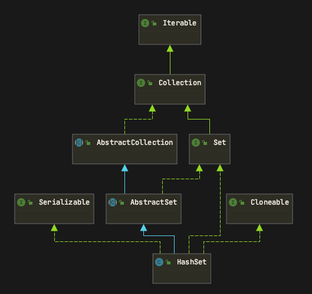

# HashSet

HashSet通过内部维护一个HashMap对象作为属性来实现Set结构。  
当添加一个元素的时候，将该元素作为Key，value为一个空的Object对象，以k-v的形式存放到hashmap中
HashSet所实现的方法都是委托HashMap来进行实现的

## 类图

## 属性

~~~ java
// HashSet通过内部维护一个map来存放元素。将需要存放的元素以Key的形式存放在map中
private transient HashMap<E,Object> map;

// 声明一个PRESENT作为常量属性。用来在Map中put元素的时候，以其作为value
private static final Object PRESENT = new Object();
~~~

## PUT方法

HashSet的put()方法就是向其内部的HashMap中放置一个元素，key是需要put的对象，value是PRESENT对象

~~~ java

public boolean add(E e) {
    // 就是往内部的map中put一个k-v结构的数据，k是需要put的元素，v就是PRESENT
    return map.put(e, PRESENT)==null;
}
~~~

## 总结

总体来说，HashSet可以说的东西并不多，主要原理还是依托于HashMap来进行实现
