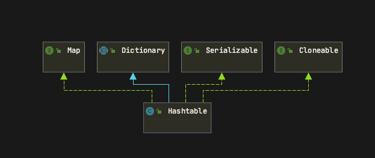

# HashTable

HashTable是一个线程安全的Map集合工具类。

## HashTable和HashMap的区别

区别 | HashMap | HashTable  
:---: | :---: | :---:
k-v是否为null | 可以为null | 不能为null，会报空指针  
父类 | AbstractMap | Dictionary
线程安全 | 线程不安全 | 线程安全  

## 类图

## 属性

~~~ java
// HashTable的基础数据结构，类似于HashMap中的Node
private transient Entry<?,?>[] table;
// 数据计数，代表着HashTable中的数据量
private transient int count;
// 阈值（重新进行Hash的阈值，默认为capacity * loadFactor，默认capacity为11，默认loadFactor为0.75）
private int threshold;
// 负载因子，默认值0.75
private float loadFactor;
~~~

## 构造方法

~~~ java
// 无参构造
public Hashtable() {
    // 调用有参构造方法，默认的初始容量11，默认的负载因子0.75
    this(11, 0.75f);
}
// 有参构造1，initialCapacity初始容量，loadFactor负载因子
public Hashtable(int initialCapacity, float loadFactor) {
    // 如果初始容量小于0，抛出异常
    if (initialCapacity < 0)
        throw new IllegalArgumentException("Illegal Capacity: "+
                                            initialCapacity);
    // 如果负载因子小于等于0或者不是数字，则抛出异常
    if (loadFactor <= 0 || Float.isNaN(loadFactor))
        throw new IllegalArgumentException("Illegal Load: "+loadFactor);
    // 如果给定的初始容量是0
    if (initialCapacity==0)
        // 则设定初始容量为1
        initialCapacity = 1;
    // 给定负载因子到属性中
    this.loadFactor = loadFactor;
    // 根据给定的容量来创建Entry数组
    table = new Entry<?,?>[initialCapacity];
    // 阈值是：给定的容量*负载因子。或者是数组的最大容量+1的最小值
    threshold = (int)Math.min(initialCapacity * loadFactor, MAX_ARRAY_SIZE + 1);
}
~~~

## Put方法

put（)方法是有synchronized锁的，线程安全。

~~~ java
// put方法，带有sychroinzed锁
public synchronized V put(K key, V value) {
    // 如果value是null，则抛出空指针异常（和HashMap区别的地方，HashMap是可以为null的）
    if (value == null) {
        throw new NullPointerException();
    }

    // 获取HashTable中的数组
    Entry<?,?> tab[] = table;
    // 获取key的hash值
    int hash = key.hashCode();
    // 根据hash值获取到在数组中的索引位置
    // 首先根据int的最大值(16个1)进行与操作，然后和数组的大小进行取模操作（取余数）
    // (hash & 0x7FFFFFFF)可以将hash值限定在int的范围内，避免超出int的范围
    // 然后与tab.length进行取余操作,可以确定在tab数组中的位置
    // 这里和hashMap不一样，HashMap是直接根据hash值直接和数组的大小-1进行与操作
    int index = (hash & 0x7FFFFFFF) % tab.length;
    @SuppressWarnings("unchecked")
    // 获取该索引位置上的原先的Entry节点
    Entry<K,V> entry = (Entry<K,V>)tab[index];
    // 如果Entry这个节点不为null,对这个Entry进行遍历,遍历到链表的尾部
    for(; entry != null ; entry = entry.next) {
        // 如果hash值相等且key的值相等
        if ((entry.hash == hash) && entry.key.equals(key)) {
            // 那么就获取到节点的值
            V old = entry.value;
            // 并且用新的value代替旧的value
            entry.value = value;
            // 将被替换的value进行返回
            return old;
        }
    }
    // 如果走到这里，说明在该索引位置上没有数据，或者链表上已有的hash值或key不匹配
    addEntry(hash, key, value, index);
    return null;
}

// 添加一个新节点的方法
private void addEntry(int hash, K key, V value, int index) {
    // 修改计数的标志位+1
    modCount++;
    // 获取到Entry数组
    Entry<?,?> tab[] = table;
    // 如果当前HashTable中的元素数量大于阈值了，这个时候就需要进行扩容操作并重新hash
    if (count >= threshold) {
        // 扩容操作并重新进行hash和分配位置
        rehash();
        // 获取新的table
        tab = table;
        hash = key.hashCode();
        // 重新获取key再table数组中的位置
        index = (hash & 0x7FFFFFFF) % tab.length;
    }

    // 获取该索引位置上原先的元素
    Entry<K,V> e = (Entry<K,V>) tab[index];
    // 创建一个新的Entry节点指向table数组的该索引位
    tab[index] = new Entry<>(hash, key, value, e);
    // HashTable的count数+1
    count++;
}
~~~

## reHash()方法

reHash将HashTable中的table进行扩容并重新进行Hash操作

~~~ java
// 对table进行扩容并重新进行hash操作
protected void rehash() {
    // 获取旧的数组容量
    int oldCapacity = table.length;
    // 将旧的数据进行暂存
    Entry<?,?>[] oldMap = table;

    // 新的容量为 旧的容量左移1位 + 1(就是旧的大小 * 2 + 1)
    int newCapacity = (oldCapacity << 1) + 1;
    // 如果新的容量比Array的最大容量要大
    if (newCapacity - MAX_ARRAY_SIZE > 0) {
        // 如果旧的容量等于数组的最大容量
        if (oldCapacity == MAX_ARRAY_SIZE)
            // 那么就保持数组的容量大小不变
            return;
        // 否则就设定为最大的数组容量
        newCapacity = MAX_ARRAY_SIZE;
    }
    // 使用心得数组容量重新创建一个Entry数组
    Entry<?,?>[] newMap = new Entry<?,?>[newCapacity];
    // 修改计数+1
    modCount++;
    // 根据新的容量和负载因子算出来新的阈值
    threshold = (int)Math.min(newCapacity * loadFactor, MAX_ARRAY_SIZE + 1);
    // 将新创建的数组指向原先的数组
    table = newMap;
    // 遍历原先的数组
    for (int i = oldCapacity ; i-- > 0 ;) {
        // 获取原先数组的该位置的数据，并依次遍历链表
        for (Entry<K,V> old = (Entry<K,V>)oldMap[i] ; old != null ; ) {
            // 这里就是重新获取Hash值，然后获取索引位置，然后重新放置在对应的位置上
            Entry<K,V> e = old;
            old = old.next;

            int index = (e.hash & 0x7FFFFFFF) % newCapacity;
            e.next = (Entry<K,V>)newMap[index];
            newMap[index] = e;
        }
    }
}
~~~
