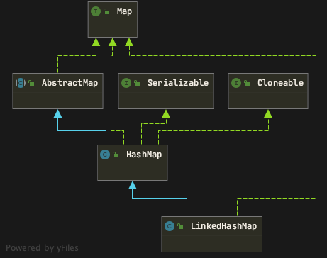

# LinkedHashMap

LinkedHashMap是有序的HashMap。内部原理是通过维护了一个双向链表（就是两个链表）完成了顺序

## 类图

## 属性

~~~ java
// 双向链表的头
transient LinkedHashMap.Entry<K,V> head;
// 双向链表的尾
transient LinkedHashMap.Entry<K,V> tail;
// 此链接的哈希映射的迭代排序方法：对于访问顺序为true ，对于插入顺序为false ?这里不是很懂，等后面再理解看看
final boolean accessOrder;
~~~

## 内部类Entry

继承自HashMap的Node，和HashMap的区别是多了一个before和after

~~~ java
static class Entry<K,V> extends HashMap.Node<K,V> {
    Entry<K,V> before, after;
    Entry(int hash, K key, V value, Node<K,V> next) {
        super(hash, key, value, next);
    }
}
~~~

## 构造方法

~~~ java
public LinkedHashMap() {
    // 使用了父类HashMap的无参构造方法
    super();
    accessOrder = false;
}

// 其余的构造方法都类似，都是走的HashMap的构造方法
~~~

## put()方法

put方法是继承自HashMap，具体的逻辑和HashMap类似。  
区别主要是LinkedHashMap重写了HashMap的afterNodeAccess和afterNodeInsertion()方法（HashMap的这两个方法为空实现）  
这里着重讲这两个方法

~~~ java
/**
 * @param evict 标志是否处于创建模式
 */
void afterNodeInsertion(boolean evict) { // possibly remove eldest
    LinkedHashMap.Entry<K,V> first;
    if (evict && (first = head) != null && removeEldestEntry(first)) {
        K key = first.key;
        removeNode(hash(key), key, null, false, true);
    }
}
~~~

~~~ java
void afterNodeAccess(Node<K,V> e) { // move node to last
    LinkedHashMap.Entry<K,V> last;
    if (accessOrder && (last = tail) != e) {
        LinkedHashMap.Entry<K,V> p =
            (LinkedHashMap.Entry<K,V>)e, b = p.before, a = p.after;
        p.after = null;
        if (b == null)
            head = a;
        else
            b.after = a;
        if (a != null)
            a.before = b;
        else
            last = b;
        if (last == null)
            head = p;
        else {
            p.before = last;
            last.after = p;
        }
        tail = p;
        ++modCount;
    }
}
~~~

## remove()方法

remove方法主要讲解LinkedHashMap所重写的afterNodeRemoval方法
